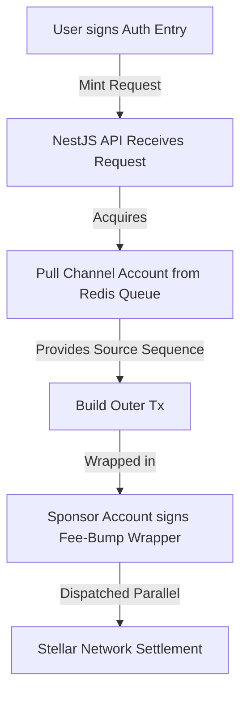

# Product Requirements Document (PRD) & Technical Implementation Blueprint
## Project Name: Drip Wave (Decentralized Ticketing System on Stellar)
## Platform Architecture: High-Throughput Decoupled Monorepo

This document serves as the comprehensive **Technical Specification and Product Requirements Document (PRD)** for bootstrapping the **Drip Wave** decentralized ticketing platform. It is designed to be fed directly into code generation engines and orchestration tools to automate repository initialization, workspace configuration, and boilerplate scaffolding.

---

## 1. System Architecture & Monorepo Orchestration

To handle highly volatile traffic patterns during primary ticket releases ("drops") without database lockups, out-of-order transaction execution, or API latency, Drip Wave utilizes a fully decoupled monorepo architecture [673]. The repository isolates concerns while sharing TypeScript interfaces and build toolchains [674, 675].

### 1.1 Repository Structure
```text
drip-wave-monorepo/
├── apps/
│   ├── api/                 # NestJS Core API (Backend) [674, 679]
│   └── web/                 # Next.js App Router Frontend [674, 692]
├── packages/
│   ├── contracts/           # Soroban Smart Contracts (Rust) [674, 681]
│   ├── docs/                # Markdown-based Technical Docs (Docusaurus) [674, 675, 676]
│   └── typescript-config/   # Shared TypeScript configurations [49, 55, 58]
├── pnpm-workspace.yaml      # Monorepo workspace configuration [674]
├── pnpm-lock.yaml           # Unified lockfile [660, 663]
├── turbo.json               # Turborepo task pipeline orchestration [675]
└── package.json             # Root monorepo configuration [674]
```

### 1.2 Configuration Files

#### Root `pnpm-workspace.yaml` [56, 280, 661, 674]
Defines the workspace boundaries for pnpm, forcing the package manager to treat the specified directories as local workspaces [56, 280, 661].
```yaml
packages:
  - "apps/*"
  - "packages/*"
```

#### Root `package.json` [56, 663, 674]
Manages root-level devDependencies, package manager constraints, and orchestrates build tasks [56, 281, 663].
```json
{
  "name": "drip-wave",
  "private": true,
  "packageManager": "pnpm@10.0.0",
  "scripts": {
    "build": "turbo run build",
    "dev": "turbo run dev",
    "test": "turbo run test",
    "lint": "turbo run lint"
  },
  "devDependencies": {
    "turbo": "^2.0.0",
    "typescript": "^5.4.0",
    "prettier": "^3.0.0"
  }
}
```

#### Root `turbo.json` [57, 675]
Orchestrates task pipelines with strict dependency graphs and build output caching [57, 289, 675].
```json
{
  "$schema": "https://turbo.build/schema.json",
  "pipeline": {
    "build": {
      "dependsOn": ["^build"],
      "outputs": ["dist/**", ".next/**"]
    },
    "dev": {
      "cache": false,
      "persistent": true
    },
    "test": {
      "outputs": []
    },
    "lint": {
      "outputs": []
    }
  }
}
```

---

## 2. Backend Framework Evaluation & Choice: NestJS vs. AdonisJS

To determine the optimal framework for a high-concurrency Web3 application under stress conditions, NestJS and AdonisJS were evaluated across key engineering vectors [676, 677, 678, 679].

### 2.1 Evaluation Matrix [679]

| Vector | NestJS (Selected Platform) | AdonisJS (Alternative Platform) |
| :--- | :--- | :--- |
| **Architecture** | Modular, decorator-driven Dependency Injection container modeled after Angular [678, 679]. | Model-View-Controller (MVC) conventions heavily inspired by Laravel/Rails [355, 677, 679]. |
| **Node.js Floor** | Compatible with LTS runtimes ($\ge$ Node 20) [362, 679]. | Strictly requires Node.js 24+ due to native V8 JIT execution hooks in `ts-exec` [357, 362, 677, 679]. |
| **Ecosystem Size** | Over 9.97 million weekly downloads; massive pool of community resources [353, 363, 365, 679]. | ~97,000 weekly downloads; highly specialized, smaller ecosystem [353, 363, 365, 677, 679]. |
| **Database/ORM** | Modular; standard compatibility with Prisma, TypeORM, or MikroORM [358, 364, 678, 679]. | Coupled directly to Lucid ORM (Active Record pattern) [355, 356, 358, 677, 679]. |
| **API Documentation** | Automated Swagger via `@nestjs/swagger` decorators (5.4M weekly downloads) [364, 365, 680]. | No native generation; requires manual OpenAPI specs or unmaintained plugins [359, 365, 680]. |
| **Performance** | High throughput (requests/sec), low CPU usage, minimal latency under heavy load [382, 383, 678, 679]. | High baseline memory footprint, CPU bottlenecks at lower request thresholds [381, 383, 679]. |

### 2.2 Framework Decision
**NestJS is selected as the primary backend API platform** [680]. Ticketing applications require high-throughput parallel execution during flash sales, robust Swagger documentation for external secondary market aggregators, and the ability to scale database queries independently [673, 678, 680]. NestJS's superior performance profile under database read stress, native `@nestjs/swagger` integration, and massive ecosystem ensure development speed and long-term maintainability [188, 365, 383, 678, 680].

---

## 3. Soroban Smart Contract Architecture & State Rental Optimizations

Soroban contracts are compiled to WebAssembly (WASM) and executed inside a sandboxed VM [574, 579, 681]. Because contract size is capped at $64	ext{ KB}$ and transactions must run with minimal resource fees, optimal compilation configurations and storage rental policies are critical [89, 215, 681, 682].

### 3.1 Cargo.toml Optimizations [215, 681]
Scaffolding for `packages/contracts/Cargo.toml` must enforce aggressive size-reduction profiles to prevent WASM size bloat [215, 681]:
```toml
[workspace]
members = ["contracts/*"]

[profile.release]
opt-level = "z"
overflow-checks = true
lto = true
codegen-units = 1
panic = "abort"
strip = true
```

### 3.2 Soroban Storage Tier Optimization [451, 497, 498, 683]
To prevent ledger "state bloat", Drip Wave explicitly maps on-chain data structures to Soroban's three storage classes [447, 448, 682]:

1. **Temporary Storage** (Extremely Cheap) [451, 497, 683]: Expired entries are permanently deleted [451, 496, 638, 683]. Used for transaction idempotency keys to prevent double-mint replay attacks [559, 689].
2. **Persistent Storage** (Expensive) [451, 498, 683]: Expired entries are moved to off-chain archives and must be restored via `RestoreFootprintOp` or `InvokeHostFunctionOp` [451, 496, 498, 683]. Used for ticket ownership maps, ticket metadata, and balances [451, 498, 500, 683].
3. **Instance Storage** (Same as Persistent) [451, 497, 683]: Shares the same TTL as the contract instance itself [451, 497, 639]. Used for global config: admin public keys, base ticket pricing, and venue capacity [450, 451, 643, 683].

### 3.3 Proactive TTL (Time-To-Live) Management [20, 481, 684, 685]
Stellar Consensus Protocol operates with an average block finality time of $5	ext{ seconds}$ [32, 560, 575, 684]. Real-time dates must be mapped to target ledger heights ($L_{	ext{target}}$) [560, 684]:
$$L_{	ext{target}} = L_{	ext{current}} + rac{T_{	ext{seconds}}}{5}$$

If tickets are released 45 days prior to an event, the minimum ledger height threshold ($L_{	ext{min}}$) required to keep ownership records alive without user-funded restoration is calculated as [685]:
$$L_{	ext{min}} = rac{45 	imes 24 	imes 60 	imes 60}{5} = 777,600	ext{ ledgers}$$

The smart contract must verify and extend the TTL of the ticket's state entries during every write or transfer operation [558, 685].

```rust
#![no_std]
use soroban_sdk::{contract, contractimpl, Env, Address, Symbol, symbol_short, log};

#[contract]
pub struct DripTicketingContract;

const LEDGER_THRESHOLD_BUMP: u32 = 17280; // ~1 day in ledgers
const LEDGER_BUMP_TO: u32 = 777600;       // ~45 days in ledgers

#[contractimpl]
impl DripTicketingContract {
    pub fn mint_ticket(env: Env, buyer: Address, ticket_id: u32) {
        buyer.require_auth(); // Secure auth check [561]
        
        let key = symbol_short!("ticket");
        env.storage().persistent().set(&(key, ticket_id), &buyer);
        
        // Proactive TTL Extension for Persistent Storage [466, 685]
        env.storage().persistent().extend_ttl(
            &(key, ticket_id), 
            LEDGER_THRESHOLD_BUMP, 
            LEDGER_BUMP_TO
        );
    }
}
```

### 3.4 Ticket Token Custom Logic: Resale Price Cap (Anti-Scalping) [688]
To eliminate scalping, Drip Wave enforces a strict resale price limit within the smart contract. Because Soroban does not support floating-point numbers, all computations are executed using scaled integer math with a 1000 multiplier [621, 624, 688].

```rust
pub fn calculate_max_resale_price(original_price: u128, max_premium_pct_scaled: u128) -> u128 {
    // Premium percentage is scaled by 1000 (e.g., 15% premium = 150) [621]
    let premium = (original_price * max_premium_pct_scaled) / 1000;
    original_price + premium
}
```

### 3.5 Replay Protection via Idempotency Keys [559, 689]
Stellar lacks transaction nonces at the contract layer [559, 690]. To prevent transaction replay attacks under high-throughput ticket drops, Drip Wave records unique idempotency keys in temporary storage, which automatically expire when the TTL ends [559, 689].

```rust
pub fn enforce_idempotency(env: &Env, idempotency_key: Symbol) {
    if env.storage().temporary().has(&idempotency_key) {
        panic!("Duplicate transaction detected!");
    }
    env.storage().temporary().set(&idempotency_key, &true);
    // Set 1-hour expiration TTL for the idempotency key [454]
    env.storage().temporary().extend_ttl(&idempotency_key, 720, 720);
}
```

---

## 4. Cryptographic Authentication & Transaction Dispatching Pipelines

Connecting users securely and processing high-concurrency ticket orders requires a secure cryptographic pipeline [689, 690].

### 4.1 SEP-10 Stellar Web Authentication [689, 690]
Users authenticate without traditional passwords by signing an invalid sequence challenge transaction generated server-side in the NestJS backend [38, 39, 438, 690]. The signature is verified on-chain, and a JWT token is issued to establish the session [38, 438, 526].

```typescript
// NestJS Authentication Service Implementation [674, 690]
import { Injectable, UnauthorizedException } from '@nestjs/common';
import { Keypair, TransactionBuilder, Networks } from '@stellar/stellar-sdk';
import * as jwt from 'jsonwebtoken';

@Injectable()
export class AuthService {
  private readonly serverKeypair = Keypair.fromSecret(process.env.SECRET_SEP10_SIGNING_SEED);
  private readonly jwtSecret = process.env.SECRET_SEP10_JWT_SECRET;

  async generateChallenge(clientPublicKey: string): Promise<string> {
    // Challenge transaction with invalid sequence and 15-minute time bound [39, 42, 528]
    const transaction = TransactionBuilder.keepAlive(
      this.serverKeypair,
      Networks.TESTNET
    );
    transaction.addOperation(
      Operation.manageData({
        source: clientPublicKey,
        name: 'Drip Web Auth',
        value: Buffer.from(Math.random().toString()),
      })
    );
    const tx = transaction.build();
    tx.sign(this.serverKeypair);
    return tx.toXDR();
  }

  async verifyChallengeAndIssueToken(signedXDR: string, clientPublicKey: string): Promise<string> {
    const tx = TransactionBuilder.fromXDR(signedXDR, Networks.TESTNET);
    // Perform SEP-10 checks: verify signatures of both server and client [41, 42, 528]
    const serverVerified = tx.signatures.some(sig => sig.hint().equals(this.serverKeypair.signatureHint()));
    const clientVerified = tx.signatures.some(sig => sig.hint().equals(Keypair.fromPublicKey(clientPublicKey).signatureHint()));

    if (!serverVerified || !clientVerified) {
      throw new UnauthorizedException('Invalid cryptographic signatures.');
    }

    return jwt.sign({ sub: clientPublicKey }, this.jwtSecret, { expiresIn: '24h' }); [42, 528]
  }
}
```

### 4.2 High-Throughput Dispatcher: Channel Accounts & Fee-Bumps [20, 690, 691]
Under standard Stellar protocol, a single account can only submit one in-flight transaction at a time [565, 690]. To handle parallel ticket minting requests during ticket drops, Drip Wave uses a pool of **Channel Accounts** combined with **Fee-Bump transactions** [20, 690, 691].

1. **User Signatures (Inner Transaction)**: The user signs the inner contract authorization payload (Soroban Auth Entry) giving permission to mint the ticket [20, 691, 692].
2. **Channel Assignment (Outer Wrapper)**: The NestJS API pulls an available Channel Account from an in-memory Redis queue [20, 691]. This Channel Account acts as the source account for the outer transaction, providing its own sequence number and enabling parallel execution [20, 691].
3. **Fee Sponsoring**: The transaction is wrapped inside a Fee-Bump envelope signed by a master Sponsor Account [20, 691]. This allows the platform to cover network gas costs, ensuring a smooth user experience where ticketholders do not need to hold native XLM balances [20, 691].



---

## 5. Client Interface Engineering & Wallet Abstraction

The Next.js frontend uses **Stellar Wallets Kit** (`@creit.tech/stellar-wallets-kit` v2.5.0+) to provide a unified interface supporting Freighter, Albedo, and mobile wallets [115, 132, 605, 692].

### 5.1 React Context Integration [117, 118, 693]
```typescript
import React, { createContext, useContext, useEffect, useState } from 'react';
import { StellarWalletsKit, WalletNetwork, FREIGHTER_ID, ALBEDO_ID } from '@creit.tech/stellar-wallets-kit';

interface WalletContextType {
  address: string | null;
  connect: () => Promise<void>;
  disconnect: () => void;
}

const WalletContext = createContext<WalletContextType | null>(null);

export const WalletProvider: React.FC<{ children: React.ReactNode }> = ({ children }) => {
  const [kit, setKit] = useState<StellarWalletsKit | null>(null);
  const [address, setAddress] = useState<string | null>(null);

  useEffect(() => {
    const swk = new StellarWalletsKit({
      network: WalletNetwork.TESTNET,
      selectedWalletId: FREIGHTER_ID,
      modules: [] // defaultModules() are auto-registered [607]
    });
    setKit(swk);
  }, []);

  const connect = async () => {
    if (!kit) return;
    const { address } = await kit.openWalletPicker({
      title: 'Connect to Drip Wave Wallet',
    });
    setAddress(address);
  };

  const disconnect = () => {
    setAddress(null);
  };

  return (
    <WalletContext.Provider value={{ address, connect, disconnect }}>
      {children}
    </WalletContext.Provider>
  );
};

export const useWallet = () => {
  const context = useContext(WalletContext);
  if (!context) throw new Error('useWallet must be used within WalletProvider');
  return context;
};
```

### 5.2 Albedo Callback Configuration [40, 693]
Web popup wallets like Albedo communicate using cross-origin window messages [40, 693]. The frontend must serve a dedicated client-side callback page at `apps/web/app/albedo-callback/page.tsx` to process messages and return them to the parent window [40, 693].
```typescript
'use client';
import { useEffect } from 'react';

export default function AlbedoCallback() {
  useEffect(() => {
    // Albedo cross-origin messenger handshake [40, 693]
    const handleCallback = () => {
      const urlParams = new URLSearchParams(window.location.search);
      const token = urlParams.get('token');
      if (window.opener) {
        window.opener.postMessage({ source: 'albedo', token }, window.location.origin);
        window.close();
      }
    };
    handleCallback();
  }, []);

  return (
    <div className="flex items-center justify-center min-h-screen">
      <p className="text-sm text-gray-500">Processing secure wallet handshake...</p>
    </div>
  );
}
```

### 5.3 Navigating WalletConnect v2 Limitations on Mobile [248, 255, 694, 695]
The standard Stellar Wallets Kit's WalletConnect module only exposes `stellar_signXDR` and `stellar_signAndSubmitXDR` [248, 255, 694]. Calling `signMessage` or `signAuthEntry` on mobile over WalletConnect v2 throws an error [248, 255, 595, 596]. Drip Wave implements a fallback path to bypass this [695]:

1. **Direct Provider Fallback**: If the active connection is WALLETCONNECT, the frontend bypasses the kit and calls `@walletconnect/universal-provider` directly to invoke the mobile methods [248, 256, 695].
2. **Offline Ticket Manifest Verification**: For gate check-ins, instead of generating a signed message via `signMessage`, the app builds a dummy, zero-fee transaction with the ticket verification payload in the transaction memo field [695]. The wallet signs this dummy transaction via `stellar_signXDR`, which is fully supported across all desktop and mobile connection types [30, 42, 695].

---

## 6. Off-Chain Event Indexing & State Synchronization

Soroban RPC nodes only retain transaction event logs for less than 7 days [20, 101, 176, 696]. To prevent gate validation failures and maintain historic ticket ownership logs, Drip Wave implements a dedicated indexing stack [20, 696, 697].

### 6.1 Indexing Options [698]

| Ingestion Strategy | Latency | Deployment Architecture | Best Suited For |
| :--- | :--- | :--- | :--- |
| **Mercury Retroshades** [46, 697, 698] | Real-time (< 1s) [47, 698] | Runs inside a custom parallel SVM fork (Zephyr VM) [46, 697, 698]. | Complex custom smart contract state variable reads [46, 698]. |
| **Alchemy Data APIs** [44, 698, 699] | Real-time [44, 698] | SaaS ingestion pipeline syncing to a ClickHouse analytical database [44, 699]. | Portfolio lists, generic ticket balances [44, 699]. |
| **Custom CDP Pipeline** [46, 698, 699] | Batch-based [46, 698] | Self-hosted Go service running Galexie and Go Ingest SDK [46, 699, 700]. | Complete database sovereignty, customized pipelines [46, 699]. |

### 6.2 Recommended Strategy: Custom CDP Pipeline [46, 699, 700]
For complete data sovereignty, Drip Wave implements a self-hosted Composable Data Pipeline (CDP) [46, 699]. A **Galexie** worker streams binary transaction metadata (`LedgerCloseMeta` in XDR format) to cloud storage, and a **Go Ingest SDK** daemon continuously processes these streams to update the local PostgreSQL database [46, 700].

---

## 7. Implementation Blueprint & Timeline (16-Week Schedule) [701]

The development roadmap is structured into four distinct, logical phases [3, 11, 701]:

### Phase 1: Smart Contract Validation (Weeks 1 - 4) [701]
- Set up the Cargo contract workspace [18, 701].
- Implement ticket minting, ownership transfers, anti-scalping price caps, and idempotency rules [701].
- Write unit tests in Rust using Soroban's native test utils to evaluate rent fees and state configurations [18, 21, 214, 701].

### Phase 2: Monorepo & NestJS Setup (Weeks 5 - 8) [701]
- Configure Turborepo pipelines and pnpm workspaces to manage workspace dependencies [4, 8, 701].
- Scaffold the NestJS backend and integrate TypeORM or Prisma models [12, 701].
- Implement the SEP-10 Web Authentication services to handle secure challenge-response wallet login [33, 701].

### Phase 3: Frontend & Wallet Handshake (Weeks 9 - 12) [701]
- Build the Next.js frontend using App Router [36, 701].
- Integrate the Stellar Wallets Kit and configure the `albedo-callback` page under `apps/web/app/albedo-callback/page.tsx` [40, 701].
- Connect the frontend UI components to the backend API to handle user wallet log-ins [701].

### Phase 4: Sync & Production Scaling (Weeks 13 - 16) [701]
- Deploy the Redis-backed Channel Accounts pool in the backend to enable parallel transaction processing [20, 701].
- Integrate Mercury Retroshades or a self-hosted CDP pipeline to index contract events into the local database [46, 47, 701].
- Perform stress testing and security audits on Stellar testnet before mainnet deployment [11, 701].

---

### References
Grounded strictly in official Stellar documentation, Soroban SDK conventions, and verified technical blueprints:
- [1] Soroban Smart Contracts Platforms & MGUSD, Stablecoin Infrastructure [574, 575].
- [2] Rust + Web3 Backend Architecture, James Bachini DEV Community [417, 418].
- [3] NFTopia Full-Stack Stellar Marketplace Architecture [317, 318, 319].
- [4] Turborepo Monorepo Structuring Guides [657, 658, 659].
- [5] pnpm Workspace Protocols [724, 726, 727].
- [6] Monorepo Build Orchestration with pnpm Workspace & Turborepo, Yasin ATEŞ [276, 279, 280, 287].
- [7] Glen Thomas Tech Blog: Mastering pnpm Workspaces [260, 262, 263].
- [8] Turborepo Caching & Multi-Language Support [307, 308, 309, 310].
- [9] Building Faster Apps with Monorepos, Sagar Shiroya [48, 54, 55].
- [10] OpenZeppelin Stellar Soroban Contracts (Rust) [403, 407, 408, 409].
- [11] Your First Stellar Smart Contract: Guide from Setup to Frontend, Pratik Kale [701].
- [12] NestJS vs. AdonisJS for Solo Developers, SoloDevStack [352, 353, 354, 355, 356, 357, 358, 359, 361, 362, 363, 364, 365, 366].
- [13] AdonisJS Documentation: FAQs and framework comparison [182, 184, 185, 186].
- [14] Comparing AdonisJS, NestJS, and Fastify: A Framework Guide [73].
- [15] AdonisJS vs. NestJS: StackShare evaluation [7].
- [16] NestJS vs. AdonisJS Performance Benchmark, Vladimir Morozov [378, 381, 382, 383].
- [17] ERC-721 vs. ERC-1155 Token standard comparison [146, 148, 150, 151, 152, 153].
- [18] Build Smart Contracts Hello World, Stellar SDK Rust Dialect [209, 213, 215, 216, 217, 218, 219, 222, 223].
- [19] Soroban Contract State Management: State Expiration & Rent model [445, 447, 448, 449].
- [20] Spiko Tech Blog: Stellar Integration, Channel Accounts, and Fee bumps [555, 556, 557, 558, 559, 560, 561, 563, 564, 565, 566, 567, 568, 569, 570, 571].
- [21] CertiK Blog: Soroban storage types and TTL vulnerabilities [451, 454, 455, 458, 461].
- [22] James Bachini: Soroban Data Locations and State Management [478, 479, 481, 482, 483, 484, 487].
- [23] Storage in soroban_sdk::storage, docs.rs [636, 638, 639, 640, 641, 642, 643].
- [24] jamesbachini/Soroban-NFT github reference [138, 741, 744].
- [25] James Bachini: Deploying an NFT using Stellar Soroban [136, 137, 138, 139, 140, 141, 142, 143].
- [26] SentinelFi: NFT contract on Soroban with OpenZeppelin [702].
- [27] OpenZeppelin Non-Fungible Token Stellar Developer Docs [385, 389, 390, 393, 394, 395].
- [28] Cheesecake Labs: Navigating Classic Assets and Soroban tokens [328, 330, 331, 332, 333, 338, 339, 341, 342, 343].
- [29] Cheesecake Labs: Writing a Bond smart contract with Soroban [614, 615, 616, 619, 621, 624, 628].
- [30] Freighter Developer Docs: Extension vs. Mobile integrations [250, 251, 252, 253, 254, 256].
- [31] Evil Martians: Anonymous web authentication with Stellar [24, 26, 27, 30, 31, 33, 34, 35, 36, 38, 41, 42, 43, 44, 45].
- [32] Stellar Developer Docs: Wallet SDK SEP-10 [539, 543, 545, 546, 547].
- [33] Platform Server Anchor Platform SEP-10 guide [521, 524, 525, 526, 527, 528].
- [34] Basic payment app: SvelteKit SEP-10 integration [432, 436, 437, 438, 439].
- [35] Freighter Wallet: Browser extension integration [197, 201, 202, 203, 204].
- [36] Dapp frontend template, Comprehensive Dapp guide [74, 77, 78, 81, 83, 84, 85, 86, 87].
- [37] Freighter API: Third-Party integrations [32, 37, 720].
- [38] Nacho Colomina Torregrosa: React hook for Stellar Wallets Kit [114, 115, 116, 117, 118, 119].
- [39] Creit-Tech/Stellar-Wallets-Kit github repository [127, 131, 132].
- [40] NPM stellar-wallet-kit usage and compatible wallets [40].
- [41] D'CENT Developer Guide: Stellar Network Integration [605, 606, 607, 608, 609, 610].
- [42] Freighter Mobile: Installation & WalletConnect integration [17, 247, 248].
- [43] Issue #815 Freighter Mobile WalletConnect methods missing [37, 592, 595, 596, 597, 600, 601, 602, 603].
- [44] Alchemy expanding Stellar Support with Data APIs [9, 10, 11, 12, 13, 14, 15, 16].
- [45] Stellar Developer Docs: Ledger events [12, 165, 169, 170, 176].
- [46] Indexers Overview, build-your-own Composable Data Platform (CDP) [16, 230, 233, 235, 237, 238, 240, 241].
- [47] Stellar Community Fund: The Mercury Ecosystem [43, 704, 705, 706, 708, 710, 711, 714].
- [48] stellar-nft-marketplace: SQLite event indexer [3, 4, 5].
